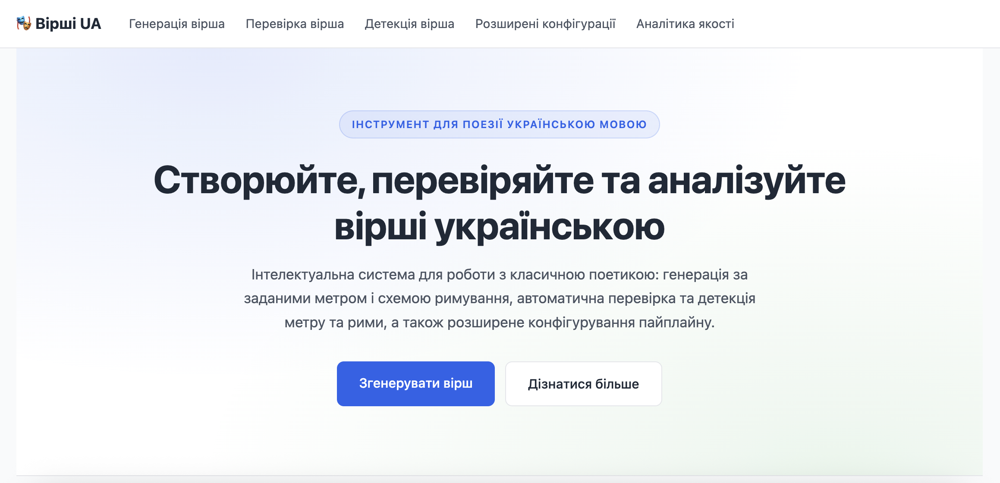

<p align="right">
  <a href="./README.md">🇬🇧 English</a> · <strong>🇺🇦 Українська</strong>
</p>

# Генератор української поезії

> Генеруйте, валідуйте та аналізуйте українську класичну поезію — LLM відповідає за слова, а лінгвістичні модулі на основі правил стежать за метром і римою.

<p align="center">
  <a href="./docs/ua/user_guide.md">
    
  </a>
  <br>
  <em>Чотири інструменти, одна сторінка — натисніть, щоб перейти до <a href="./docs/ua/user_guide.md">документації користувача</a>.</em>
  <br><br>
  <a href="https://youtu.be/9-8JHxPXHLE">▶ Переглянути демо-відео</a>
</p>

[]() []() []() []()

```text
Тема: «тріумф»
Метр: амфібрахій, 4 стопи · Рима: ABAB · Строф: 1

→ Нарешті здобуто жаданий вінець,
  і зникли холодні тумани осінні.
  Скінчились тривоги, радіє борець,
  і сяють вершини ясні та нетлінні.

✓ метр 100% · ✓ рима 100% · 2 LLM-спроби · \$0.02
```

Веб-інтерфейс, JSON API і дослідницький інструментарій в одному пакеті — побудовано за принципами чистої архітектури, повністю відтворюваний Python-проєкт у форматі магістерського / дослідницького прототипу.

---

## Навіщо це потрібно

Великі мовні моделі пишуть вільною українською, але **систематично порушують формальні обмеження** класичної поезії: ставлять наголос не там, де треба, плутаються в кількості складів, видають «псевдо-рими» лише на однакових суфіксах. Самі себе виправити вони не можуть — у них немає внутрішньої моделі метру чи рими.

Цей проєкт **розмежовує обов'язки**: LLM генерує слова; **лінгвістичні модулі на основі правил** валідують **метр**, порівнюючи фактичну схему наголосів (визначену за словником українських наголосів) з очікуваним шаблоном стопи, та валідують **риму**, транскрибуючи закінчення рядків в IPA та обчислюючи фонетичну подібність (відстань Левенштейна по римовій частині — від наголошеної голосної і далі). Якщо вірш не пройшов валідацію, LLM отримує структурований фідбек для прицільної регенерації.

Пайплайн **прозорий і вимірюваний**: кожен етап лишає трейс, кожна метрика має ім'я, а абляційний каркас кількісно оцінює, який внесок дає кожен компонент (семантичний RAG, метрико-римові few-shot приклади, цикл фідбеку).

---

## Системні вимоги

Усе працює в Docker, тож локально не потрібно встановлювати Python / Stanza / sentence-transformers — Docker сам подбає про залежності. Але самій хост-машині все одно потрібно достатньо ресурсів під контейнери.

### Програмні передумови

- **Docker** 20+ — Docker Desktop на macOS / Windows; нативний engine на Linux
- **Docker Compose** v2 (іде в комплекті з Docker Desktop)
- **GNU Make** (вже встановлений на macOS / Linux; на Windows — `choco install make`)
- **Git** — щоб клонувати репозиторій
- **(Windows)** увімкнений WSL2 **або** Hyper-V — Docker Desktop потребує одного з двох бекендів; нативні Windows-контейнери не підтримуються. WSL2 — сучасний дефолт; Hyper-V підходить як альтернатива (наприклад, на Windows 10 Pro без WSL2)

### Залізо (рекомендовано для повної системи)

| Ресурс | Мінімум (тільки mock LLM) | Рекомендовано (з LaBSE + реальним LLM) |
|--------|----------------------------|-------------------------------------------|
| **CPU** | будь-який 64-бітний, 2+ ядра | 4+ ядра |
| **RAM (вільної)** | 4 ГБ | **8 ГБ** (інференс LaBSE під час роботи з'їдає ~2-3 ГБ) |
| **Диск (вільного)** | 5 ГБ | **15 ГБ** (Docker-образи ~5 ГБ + LaBSE ~1.8 ГБ + Stanza ~500 МБ + кеш + запас під корпус) |
| **GPU** | не потрібен | не потрібен (CPU цілком достатньо для інференсу LaBSE на низькому навантаженні; Gemini рахується на стороні Google) |
| **Мережа** | лише для початкового завантаження Docker-образів | + вихідний HTTPS до Google на кожен виклик Gemini |
| **ОС** | macOS 11+ / Linux (ядро 4.x+) / Windows 10/11 + WSL2 або Hyper-V | те саме |

> **Перший запуск** завантажує LaBSE (~1.8 ГБ) і Stanza (~500 МБ) у Docker-том. Закладайте ~5-15 хвилин на типовому домашньому інтернеті. Далі моделі кешуються, і наступні запуски стартують миттєво.

---

## Спробуйте за 60 секунд

<details>
<summary><strong>Варіант A — повна система з реальним Gemini (рекомендовано)</strong></summary>

```bash
git clone https://github.com/DzOlha/poetry-generation-ua.git
cd poetry-generation-ua
cp .env.example .env
# відредагуйте .env і впишіть свій Gemini API-ключ у GEMINI_API_KEY
make serve
```

Відкрийте http://localhost:8000.

**Як отримати Gemini API-ключ (одноразово, ~5 хв):**

1. Зайдіть на **<https://aistudio.google.com/apikey>** → увійдіть із Google-акаунтом.
2. Натисніть **«Create API key»** → скопіюйте ключ.
3. За замовчуванням проєкт використовує модель **`gemini-3.1-pro-preview`** — вона дає найкращі результати на українській поезії, але це **платна** модель. Щоб нею користуватися, треба ввімкнути оплату (billing):
   - Зайдіть на **<https://aistudio.google.com/billing>**.
   - Натисніть **«Set up billing»** → прив'яжіть спосіб оплати (кредитну картку).
   - Це означає реальні гроші з картки: щоб перейти з безкоштовного tier у платний Tier 1 (де живе `gemini-3.1-pro-preview`), Google вимагає першу оплату — на практиці близько **\$30** (одноразово, для активації білінгу). \$300 Google Cloud free trial credit, який пропонується новим Cloud-акаунтам, **до Gemini API не застосовується** — він покриває лише інші Cloud-сервіси (Compute Engine, BigQuery тощо). Тобто плануйте, що за кожен виклик Gemini ви платитимете повну вартість зі своєї картки.
4. Вставте ключ у `.env`:
   ```
   GEMINI_API_KEY=your_key_here
   GEMINI_MODEL=gemini-3.1-pro-preview
   ```
5. Орієнтовна ціна (актуальні значення — на **<https://ai.google.dev/pricing>**, вони змінюються):
   - **gemini-3.1-pro-preview** (дефолт): \$2 / 1M input-токенів, \$12 / 1M output-токенів. Типовий вірш на 1 строфу з 1 ітерацією фідбеку коштує **~\$0.04**.
   - **gemini-2.5-pro**: \$1.25 / 1M in, \$10 / 1M out. Дешевше, але якість трохи гірша.
   - **gemini-2.5-flash** (доступний free tier): **значно гірша якість** для строгої поетичної структури — годиться лише для smoke-тестування пайплайна, не для реальної генерації. Налаштування: `GEMINI_MODEL=gemini-2.5-flash`.
6. **Якщо змінюєте `GEMINI_MODEL`, обов'язково оновіть і env-змінні з ціною** — інакше відображувана вартість (`~\$0.04` біля кожного згенерованого вірша, тотали в ablation тощо) буде неправильною. Калькулятор просто множить токени на ці значення — він не «знає», яку модель ви обрали:
   ```
   GEMINI_INPUT_PRICE_PER_M=2.0       # дефолт відповідає gemini-3.1-pro-preview
   GEMINI_OUTPUT_PRICE_PER_M=12.0
   ```
   Довідкові значення на 1M токенів (input / output): `gemini-3.1-pro-preview` 2.00 / 12.00 · `gemini-2.5-pro` 1.25 / 10.00 · `gemini-2.0-flash` 0.10 / 0.40. Для інших / новіших моделей дивіться **<https://ai.google.dev/pricing>**.

</details>

<details>
<summary><strong>Варіант B — роздивитися без жодних оплат</strong></summary>

```bash
git clone https://github.com/DzOlha/poetry-generation-ua.git
cd poetry-generation-ua
make serve   # .env не потрібен
```

Відкрийте http://localhost:8000. Генерацію вимкнено (форму заблоковано з відповідним повідомленням), проте **валідація, детекція та аналітика працюють у повному обсязі** — корисно, щоб ознайомитися з архітектурою та лінгвістичними модулями.

</details>

---

## Що показує веб-інтерфейс

Відкрийте http://localhost:8000 — побачите **чотири інструменти**, кожен на своїй сторінці:

| Сторінка | Що робить                                                                            | Потрібен API-ключ? |
|----------|--------------------------------------------------------------------------------------|---------------------|
| 🪶 **Генерація** | «Згенеруй вірш на тему X з метром Y і римовою схемою Z»                              | так |
| ✓ **Валідація** | «Перевір цей вірш на метр Y і схему Z; покажи, де порушення»                         | ні |
| 🔍 **Детекція** | «Який метр і римову схему має цей вірш?»                                             | ні |
| ⚙️ **Розширені конфігурації** | Прогін наперед заданих сценаріїв через абляційні конфіги A–H, повний трейс пайплайна | так |
| 📊 **Аналітика якості** | Дослідницький дашборд із внесками paired-Δ, CI, графіками                            | ні (читає попередньо обчислені звіти) |

---

## Як це працює (одна діаграма)

```
Користувач: тема + метр + рима + кількість строф
                ↓
   ┌────────────────────────────┐  ┌────────────────────────────┐
   │  Семантичний RAG (LaBSE)   │  │  Метрико-римові приклади   │
   │  тематично подібні вірші   │  │  верифіковані вірші з      │
   │  з корпусу                 │  │  саме таким метром+римою   │
   └─────────────┬──────────────┘  └──────────────┬─────────────┘
                 └──────── RAG-промпт ─────────────┘
                                ↓
                       LLM-генерація (Gemini)
                                ↓
              ┌──────────────────────────────────────┐
              │  Валідація за правилами              │
              │  • Метр:  фактична схема наголосів   │
              │           vs очікуваний шаблон стопи │
              │  • Рима:  IPA-транскрипція закінчень │
              │           рядків + Левенштейн по     │
              │           римовій частині            │
              └─────────────┬────────────────────────┘
                            ↓
                  не пройшло? → структурований фідбек
                            ↓
                  регенерація через LLM (до 3×)
                            ↓
                       фінальний вірш + метрики
```

LLM відповідає за **зміст**; модулі на правилах — за **форму**. Валідація детермінована й пояснювана: для кожного вердикту «зламано» система може назвати конкретну причину — номери складів, які мали бути наголошеними, проти тих, що насправді наголошені (наприклад, *expected: 2, 4, 6, 8 / actual: 1, 4, 6, 8*); IPA-суфікс римового партнера проти фактичного суфікса рядка; та числовий бал римової подібності, який не дотягнув до порога (наприклад, *score: 0.42*).

---

## Технологічний стек

- **Backend**: Python 3.13 · FastAPI · Pydantic · Poetry · Jinja2
- **LLM**: Google Gemini (модель налаштовується: 2.0-flash, 2.5-pro, 3.x-pro)
- **Лінгвістика**:
  - Метр — `ukrainian-word-stress` (на базі Stanza) для визначення наголосів + власний алгоритм Pattern для зіставлення зі шаблонами стопи
  - Рима — власний транскриптор «українська → IPA» + відстань Левенштейна по римовій частині (від наголошеної голосної і далі) + класифікатор (точна / асонанс / консонанс / неточна / немає)
- **RAG**: мультимовні sentence-embedding-и LaBSE (`sentence-transformers`)
- **Надійність**: типізований стек декораторів retry / timeout / sanitization зі структурованим маппінгом `DomainError` → HTTP
- **Quality gate**: 1131 тест (1058 unit + 71 integration + 2 component), 91% покриття, ruff (lint), mypy (typecheck) — усе ганяється через `make ci`
- **Відтворюваність**: усе працює в Docker; `Makefile` — єдина точка входу

---

## Куди далі

📍 **Ви новачок і просто хочете користуватися** → [`docs/ua/user_guide.md`](./docs/ua/user_guide.md) ([🇬🇧](./docs/en/user_guide.md))
   Сторінки, обмеження вводу, очікувані тайминги, ціна, помилки, FAQ.

🎓 **Ви оцінюєте проєкт в академічному контексті** → [`docs/ua/system_overview_for_readers.md`](./docs/ua/system_overview_for_readers.md) ([🇬🇧](./docs/en/system_overview_for_readers.md))
   «Що це й навіщо» простою мовою, без деталей реалізації.

🛠️ **Ви контриб'ютор / розробник** → [`docs/ua/system_overview.md`](./docs/ua/system_overview.md) ([🇬🇧](./docs/en/system_overview.md))
   Повний огляд у 16 розділах: кожен компонент, кожен інтерфейс, кожне рішення.

🔬 **Ви дослідник, який запускає абляції** → [`docs/ua/evaluation_harness.md`](./docs/ua/evaluation_harness.md) ([🇬🇧](./docs/en/evaluation_harness.md))
   Каркас «18 сценаріїв × 8 конфігів», batch-runner, paired-Δ аналіз.

🧠 **Алгоритми в деталях** → [метр](./docs/ua/meter_validation.md) · [рима](./docs/ua/rhyme_validation.md) · [наголоси](./docs/ua/stress_and_syllables.md) · [детекція](./docs/ua/detection_algorithm.md) · [цикл фідбеку](./docs/ua/feedback_loop.md) · [LLM-стек декораторів](./docs/ua/llm_decorator_stack.md)

🏛️ **Архітектурні рішення** → [`docs/adr/`](./docs/adr/)

> Документація двомовна (UA + EN), синхронізована.

---

## Програмне використання

Якщо хочете інтегрувати в свій пайплайн замість веб-інтерфейсу:

```python
from src.composition_root import build_poetry_service
from src.config import AppConfig
from src.domain.models import (
    GenerationRequest, MeterSpec, PoemStructure, RhymeScheme,
)

service = build_poetry_service(AppConfig.from_env())

result = service.generate(GenerationRequest(
    theme="весна у лісі, пробудження природи",
    meter=MeterSpec(name="ямб", foot_count=4),
    rhyme=RhymeScheme(pattern="ABAB"),
    structure=PoemStructure(stanza_count=1, lines_per_stanza=4),
    max_iterations=2,
))

print(result.poem)
print(f"метр {result.validation.meter.accuracy:.0%} · "
      f"рима {result.validation.rhyme.accuracy:.0%}")
```

Також доступний JSON API — Swagger на http://localhost:8000/docs після `make serve`.

---

## Структура проєкту

```
src/
├── domain/            # чисто-Python моделі + порти (інтерфейси)
├── infrastructure/    # адаптери: валідатори, LLM, retrieval, трасування, persistence
├── services/          # фасади use-case (PoetryService, EvaluationService, ...)
├── handlers/
│   ├── api/           # FastAPI JSON-роути
│   └── web/           # Jinja-шаблонні сторінки
└── composition_root.py  # DI (зв'язування залежностей)
docs/                  # двомовна документація
data/                  # сирі .txt-файли віршів — джерело корпусу
corpus/                # зібрані й закомічені тематичний + метричний корпуси (JSON)
tests/                 # unit (1058) + integration (71) + component (2) тести
results/               # вивід batch-прогонів (gitignored)
```

Це шари чистої архітектури; внутрішні шари (`domain`, `services`) не імпортують інфраструктуру.

---

## Найчастіші команди

| Команда | Що робить                                                                |
|---------|--------------------------------------------------------------------------|
| `make serve` | Запустити веб-інтерфейс на http://localhost:8000                         |
| `make test` | Прогнати всі тести в Docker                                              |
| `make ci` | Lint + typecheck + тести (повний CI gate)                                |
| `make demo` | Прогнати дефолтний сценарій через увесь пайплайн і вивести трейс         |
| `make ablation` | Запустити 18 × 8 × 3 = 432 абляційних прогони (~\$25–50 на Gemini Flash) |
| `make ablation-cheap` | Те саме, що `ablation`, але `SEEDS=1` (~\$8–15, ~90% сигналу)            |
| `make ablation-report RUNS=results/batch_…/runs.csv` | Згенерувати PNG-графіки + дані для дашборду                              |
| `make build-theme-corpus-with-embeddings` | Перебудувати тематичний RAG-корпус із сирих `data/`                      |

Повний довідник з Makefile: `make help` (або просто відкрийте `Makefile` — він докладно прокоментований).

---

## Конфігурація (основне)

Більшість налаштувань працює одразу. Єдина обов'язкова env-змінна — `GEMINI_API_KEY`.

| Змінна | Дефолт | Призначення |
|--------|--------|-------------|
| `GEMINI_API_KEY` | — | Ключ Google Gemini (обов'язковий для генерації). Інструкція з налаштування — у [Спробуйте за 60 секунд § Варіант A](#варіант-a--повна-система-з-реальним-gemini-рекомендовано) |
| `GEMINI_MODEL` | `gemini-3.1-pro-preview` | Назва моделі. **Платна** (~\$2/1M in, ~\$12/1M out). Для безкоштовного smoke-тестування: `gemini-2.5-flash` (значно гірша якість для поезії) |
| `LLM_TIMEOUT_SEC` | `120` | Жорсткий таймаут на один виклик. 120 с підходить для Pro-моделей з міркуванням; знизьте до 20 с, якщо перемикаєтесь на Flash |
| `OFFLINE_EMBEDDER` | `false` | `true` → пропустити завантаження LaBSE (детермінована заглушка для тестів / офлайн-розробки) |

Повна таблиця + застереження для reasoning-моделей: [`docs/ua/reliability_and_config.md`](./docs/ua/reliability_and_config.md).

---

## Поточний стан

- ✅ **1131 тест** (1058 unit + 71 integration + 2 component) — `make ci` зелений
- ✅ **91% покриття рядків**, 84% покриття гілок
- ✅ **Без помилок типізації** (mypy strict на `src/` і `tests/`)
- ✅ **Відтворюваність**: Docker + Poetry lock + детермінований офлайн-замінник ембедера
- ✅ **Двомовна документація** (UA + EN), що описує кожен компонент і контракт

---

## Академічний контекст

Магістерський проєкт, 2026. Демонструє:

- **Гібридну AI-архітектуру**: поєднання нейронної генерації тексту із символьною лінгвістичною верифікацією.
- **Кількісну абляцію**: дизайн paired-Δ з bootstrap-CI кількісно оцінює маргінальний внесок кожного компонента.
- **Дисципліну чистої архітектури**: гексагональна структура зі строгим розділенням port/adapter, кожен шар можна тестувати ізольовано.

Можна цитувати як дослідницький артефакт або брати за основу для аналогічних пайплайнів на інших слов'янських / морфологічно багатих мовах.

---

## Ліцензія

Проєкт ліцензовано на умовах **[PolyForm Noncommercial License 1.0.0](./LICENSE)** — повний текст у [`LICENSE`](./LICENSE).

Коротко:

| Випадок | Дозволено цією ліцензією? |
|---------|----------------------------|
| Особисте дослідження, навчання, хобі-проєкти | ✅ Так (безкоштовно) |
| Академічні / некомерційні / освітні дослідження | ✅ Так (безкоштовно) — будь ласка, цитуйте (див. [`CITATION.cff`](./CITATION.cff)) |
| Державний сектор, урядові установи, NGO | ✅ Так (безкоштовно) |
| Модифікація, форки, перерозповсюдження для перерахованого вище | ✅ Так (з атрибуцією та збереженням ліцензії) |
| Інтеграція в комерційний продукт / SaaS / платний сервіс | ❌ Потрібна окрема комерційна ліцензія |
| Продаж похідних або використання з метою отримання прибутку | ❌ Потрібна окрема комерційна ліцензія |

**Для комерційного використання:** пишіть на **olhadziuhal@gmail.com** — комерційне ліцензування пропонується на адекватних умовах.

Українські поетичні тексти в `data/` цією ліцензією не охоплено — вони залишаються об'єктом авторського права своїх авторів (більшість авторів, що померли до 1953 року, перебувають у суспільному надбанні в Україні; пізніші — не обов'язково). Деталі — у `LICENSE` § *Scope*.
