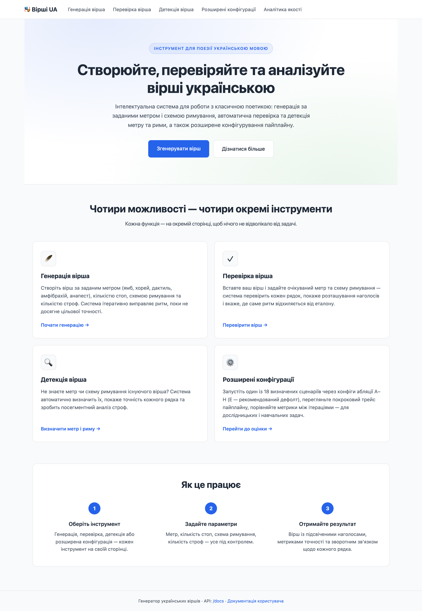
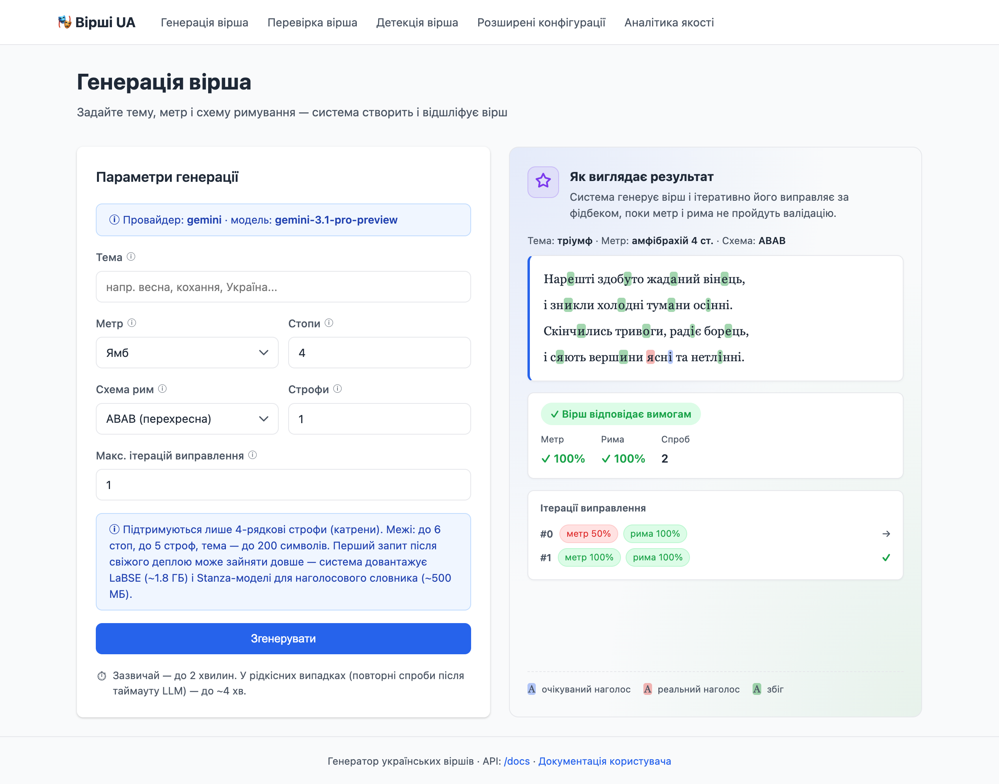
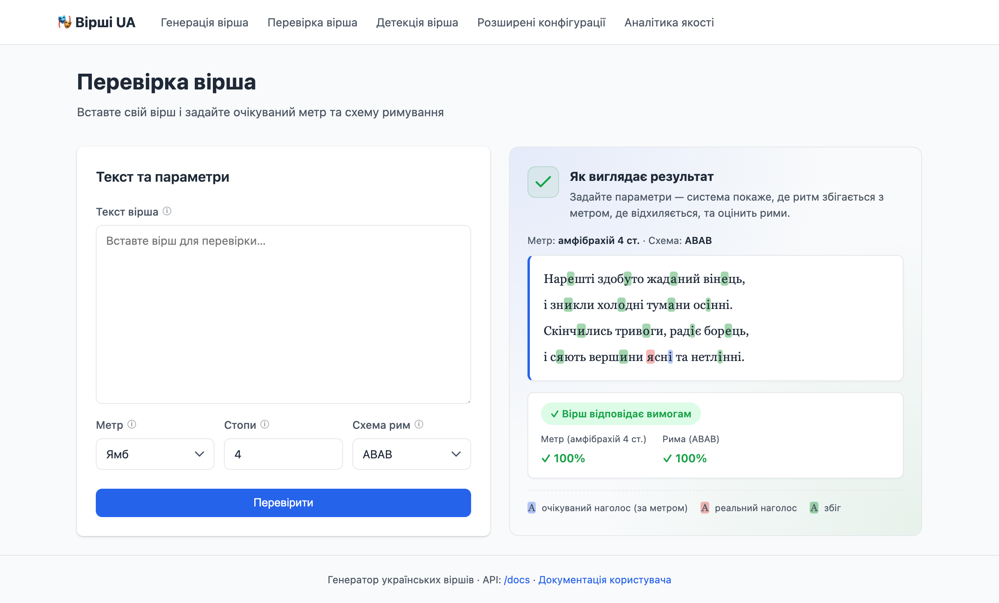
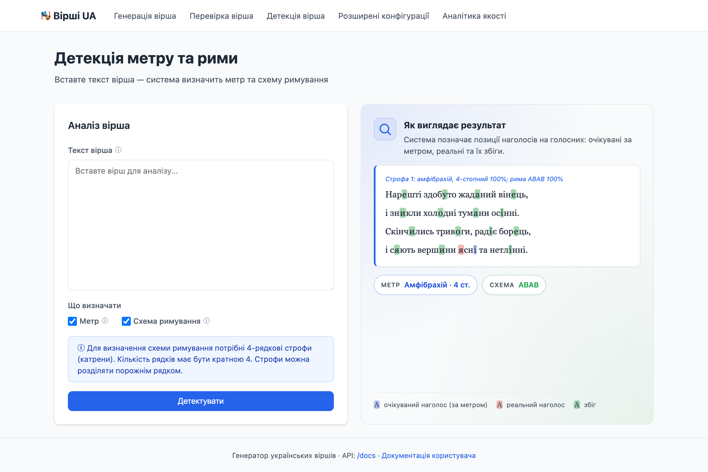
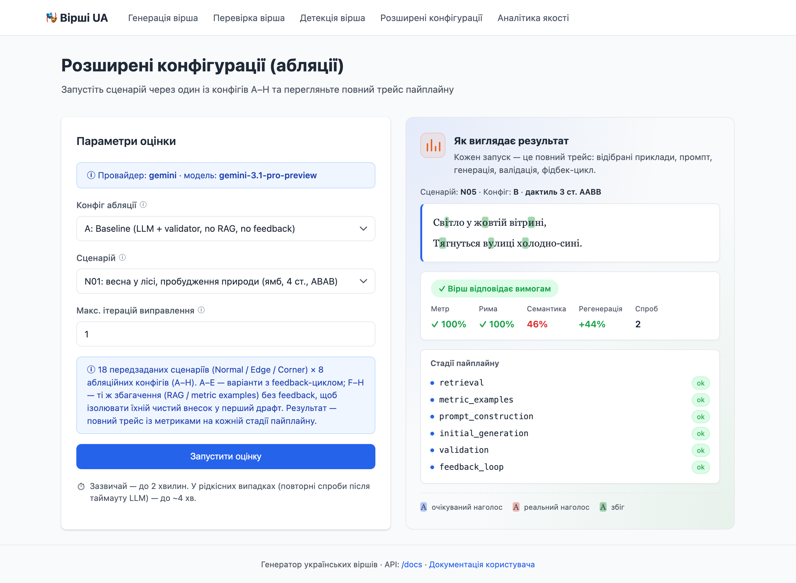

# User guide

> This document is for the **end user** of the system (not the developer). It covers what the system does, how to use it via the web UI, what input limits apply, how long things take, what they cost, and how to read errors.
>
> If you are a developer or want to understand the architecture, see [`README.md`](../../README.md), [`system_overview.md`](./system_overview.md), and [`system_overview_for_readers.md`](./system_overview_for_readers.md).

---

## 1. What this is and who it's for

The system generates, validates, and analyses Ukrainian poetry written in classical syllabotonic metrics. It fits:

- **Poets** — quickly check your own text for meter and rhyme; see exactly where the rhythm breaks.
- **Teachers and philology students** — visual demonstration of feet, clausulae, rhyme schemes.
- **Researchers** — measurable pipeline with RAG, feedback loop, and ablation configurations.
- **Curious people** — generate a poem on a chosen theme end-to-end.

---

## 2. Demo video

[](https://youtu.be/9-8JHxPXHLE)

---

## 3. How to launch

The simplest way is Docker:

```bash
git clone https://github.com/DzOlha/poetry-generation-ua.git
cd poetry-generation-ua
echo "GEMINI_API_KEY=your_key_here" > .env   # get one at https://ai.google.dev
make serve                                    # http://localhost:8000
```

Without `GEMINI_API_KEY`, the system still starts but the generation form is **disabled** with a "GEMINI_API_KEY missing" notice. Validation, detection, and analytics work without an LLM key.

For the full env-var reference, see [`README.md` § Environment Variables](../../README.md#environment-variables) and [`reliability_and_config.md`](./reliability_and_config.md).

---

## 4. Web UI pages

| URL | What it does | Needs LLM? |
|------|---------------|--------------|
| [`/`](http://localhost:8000/) | Landing page — catalogue of pages | No |
| [`/generate`](http://localhost:8000/generate) | Generate a poem from given parameters | **Yes** |
| [`/validate`](http://localhost:8000/validate) | Validate someone else's poem against meter/scheme | No |
| [`/detect`](http://localhost:8000/detect) | Auto-detect meter and rhyme scheme in a text | No |
| [`/evaluate`](http://localhost:8000/evaluate) | Run a preset scenario through config A–H (E recommended; F–H research-only) | **Yes** |
| [`/ablation-report`](http://localhost:8000/ablation-report) | Quality analytics — plots, confidence intervals, cost breakdown | No |
| [`/docs`](http://localhost:8000/docs) | Swagger UI for the JSON API | — |



> The UI is Ukrainian-only (the system targets Ukrainian poetry); the screenshots above are illustrative.

### 4.1 Generation

Form fields:

| Field | Type | Range | Default |
|--------|------|--------|---------|
| Theme | text | 1–**200** chars | — |
| Meter | dropdown | iamb / trochee / dactyl / amphibrach / anapest | iamb |
| Feet | number | 1–**6** | 4 |
| Rhyme scheme | dropdown | ABAB / AABB / ABBA / AAAA | ABAB |
| Stanzas | number | 1–**5** | 1 |
| Max correction iterations | number | 0–3 | 1 |

Output: one or more quatrains in Ukrainian with stress markers. Result-page metrics: meter accuracy, rhyme accuracy, semantic relevance to the theme, regeneration success, LLM call count, tokens spent, and cost in USD.



### 4.2 Validation

Inputs: poem text (1–**5000** chars), expected meter, foot count (1–6), rhyme scheme. Output: per-character stress overlay (expected / actual / matches), violation flags, accuracy in %.



### 4.3 Detection

Inputs: poem text only (1–5000 chars) + checkboxes ("detect meter / scheme"). The algorithm sweeps 5 canonical meters × 1–6 feet for meter and 4 canonical schemes (ABAB / AABB / ABBA / AAAA) for rhyme. Acceptance threshold: 85% accuracy for meter, ~50% for rhyme. **Cannot detect**: non-classical / syllabic / free verse; 18th-c. poetry with irregular accentuation; rare dialect forms (stress resolver weakness).



### 4.4 Advanced configurations (ablations)

A page for **researchers**. 18 preset scenarios (Normal / Edge / Corner) × 8 pipeline configs (A–H):

- **A** — baseline: LLM + validator only, no RAG, no feedback.
- **B–E** — incremental builds with feedback loop: B (feedback only), C (RAG + feedback), D (metric examples + feedback), E — full system.
- **F–H** — same enrichments as C/D/E but **without the feedback loop**: F = pure RAG, G = pure metric examples, H = both. Designed to measure each enrichment's **raw** contribution to the first draft (without feedback masking the effect via iterative repair).

Runs one scenario through the chosen config and returns a full pipeline trace with per-stage metrics.



### 4.5 Quality analytics

Dashboard with results of ablation runs (typically 18 scenarios × 8 configs × 3 seeds = 432 runs). It shows:

- Forest plot — contribution of each component with 95% CI;
- Box plot — metric distributions across configs;
- Heatmap — scenario × config matrix;
- Per-category histograms.

The page has a collapsible **Glossary of terms** (seed, paired delta, CI, Wilcoxon p-value, etc.).

The report is **not generated automatically** — run `make ablation` (432 LLM calls, ~2-3 hours). On the default `gemini-3.1-pro-preview` — ~\$50-100; on `gemini-2.5-pro` — ~\$35-70; on `gemini-2.5-flash` — ~\$3-7 (but the ablation results on Flash are less representative). Then `make ablation-report`.

---

## 5. Input limits (summary)

The system validates input at three layers: HTML form, FastAPI Form / Query, Pydantic schema. All limits match — no way to slip past one and hit another.

| Field | Min | Max | Why this limit |
|--------|-----|-----|------------------|
| Theme (generation) | 1 char | 200 chars | More doesn't improve semantic search; just bloats the LLM prompt |
| Poem text (validate / detect) | 1 char | 5000 chars | ~50 lines is a practical maximum; algorithms are linear, but time scales linearly |
| Meter (dropdown) | — | — | Only 5 canonical: iamb, trochee, dactyl, amphibrach, anapest |
| Feet per line | 1 | **6** | 7–8 feet = 16–24 syllables; rare even for alexandrines |
| Rhyme scheme (dropdown) | — | — | Only ABAB / AABB / ABBA / AAAA (quatrains) |
| Stanzas | 1 | **5** | 5 × 4 = 20 lines ≈ 1500 output tokens × 3 iterations — practical cap |
| Max correction iterations | 0 | 3 | Above 3 cost grows linearly with no measurable quality gain (per ablation results) |

Exceeding these → HTTP 422 (`Unprocessable Entity`) with the offending field named.

---

## 6. Time and money

### Time

| Scenario | Typical | Worst case |
|----------|---------|--------------|
| Validation / detection (no LLM) | < 1 s | ~ 2–3 s (on 5000 chars) |
| Generation, 1 stanza, 1 iteration | 30–60 s | ~ 2 min |
| Generation, 1 stanza, 3 iterations | 1–2 min | ~ 4 min |
| Generation, 5 stanzas, 3 iterations | 2–3 min | ~ 5–6 min |

Worst case includes: one LLM timeout (120 s) + a retry + exponential backoff. The forms surface "taking longer than expected" after the 2-minute mark.

**First request after a fresh deploy** — add 1–2 minutes: the system downloads the LaBSE semantic model (~1.8 GB) and Stanza models for the stress dictionary (~500 MB). Subsequent requests are fast.

### Money

The default LLM is **Google Gemini** with **`gemini-3.1-pro-preview`** (set via `GEMINI_MODEL`). This is a **paid** model — other models (the Flash family in particular) give substantially worse results for Ukrainian poetry. We recommend pro-preview as the baseline for typical use.

#### Pricing

Approximate (verify on <https://ai.google.dev/pricing> — these change):

| Scenario | Tokens (in / out) | `gemini-3.1-pro-preview` (recommended) | `gemini-2.5-pro` (alternative) | `gemini-2.5-flash` (free tier) |
|----------|---------------------|-------------------------------------------|-----------------------------------|---------------------------------|
| Price / 1M tokens | — | \$2.00 in / \$12.00 out | \$1.25 in / \$10.00 out | \$0.10 in / \$0.40 out (paid); free quota available |
| 1 stanza, 0 iterations | ~3000 / ~500 | ~\$0.012 | ~\$0.009 | ~\$0.0005 |
| 1 stanza, 3 iterations | ~10000 / ~1500 | ~\$0.040 | ~\$0.028 | ~\$0.0016 |
| 5 stanzas, 3 iterations | ~30000 / ~5000 | ~\$0.120 | ~\$0.088 | ~\$0.005 |

Exact cost per run is shown on the result page ("\$0.0234").

> ⚠️ **If you change `GEMINI_MODEL`, also update the price env vars.** The cost calculator (`EstimatedCostCalculator`) just multiplies token counts by these numbers — it does **not** know which model you picked. Leaving the defaults `GEMINI_INPUT_PRICE_PER_M=2.0` / `GEMINI_OUTPUT_PRICE_PER_M=12.0` while running `gemini-2.5-flash` makes every result-page and ablation-report cost reading 10–20× higher than reality. Set the matching pair in `.env`:
>
> | Model | `GEMINI_INPUT_PRICE_PER_M` | `GEMINI_OUTPUT_PRICE_PER_M` |
> |-------|---------------------------|------------------------------|
> | `gemini-3.1-pro-preview` (default) | `2.0` | `12.0` |
> | `gemini-2.5-pro` | `1.25` | `10.0` |
> | `gemini-2.0-flash` | `0.10` | `0.40` |
>
> For other / newer models, look up current numbers at <https://ai.google.dev/pricing>. Reasoning ("thoughts") tokens on Pro models are billed as output.

#### How to set up billing

1. Visit <https://aistudio.google.com/apikey>, sign in with a Google account, and create an **API key**.
2. To use pro-preview you must enable billing at <https://aistudio.google.com/billing> — link a credit card.
3. **Important about cost.** Pro-preview lives on paid Tier 1, and activating it requires Google to take a real first payment from your card (around **\$30** in practice — a one-off charge). The **\$300 Google Cloud free trial credit** new Cloud accounts receive **does not apply to the Gemini API** — it only covers other Cloud services (Compute Engine, BigQuery, etc.). So plan to pay full price out of pocket for every Gemini call.
4. Paste the key into `.env`:
   ```
   GEMINI_API_KEY=your_key_here
   GEMINI_MODEL=gemini-3.1-pro-preview
   ```

#### If you don't want to pay

The alternative is `gemini-2.5-flash` (works under the free tier): roughly **~10 requests/min, ~250/day** as of April 2026 (Google has been tightening these — e.g. December 2025 cut free-tier limits by 50–80%). Verify the current numbers at **<https://ai.google.dev/gemini-api/docs/rate-limits>**. **Quality for poetry is noticeably worse** (mis-counts meter, often misses rhyme, frequently produces "unsingable" lines) — fine for smoke-testing the pipeline, not for real generation. Set:
```
GEMINI_MODEL=gemini-2.5-flash
```

**When you hit the limit** you'll get HTTP 429 with "Daily limit of N requests reached" (in Ukrainian on the page). The counter resets at midnight Pacific Time (PT).

---

## 7. Reading result metrics

| Metric | Meaning | Healthy range |
|---------|----------|------------------|
| **Meter accuracy** | Fraction of lines that pass meter validation (with up to 2 hard stress errors per line) | 100% — clean; 75–99% — minor issues; <75% — serious mismatches |
| **Rhyme accuracy** | Fraction of rhyme pairs that pass the phonetic threshold (≥ 55% IPA similarity from the stressed vowel) | 100% — all pairs rhyme; 50% — half don't; 0% — no rhymes at all |
| **Semantic relevance** | Cosine similarity of LaBSE embeddings (theme vs. poem), in % | ≥ 50% — clearly on-topic; <30% — likely drifted |
| **Regeneration success** | Improvement in the combined score between first and last iteration, in points | +X% — feedback loop helped; 0% — no change; negative — got worse (rare) |
| **Attempts** | Total LLM calls: 1 = initial draft only, +1 per correction iteration | — |

> **If meter is 100% and rhyme is 100%** but a clearly 6-syllable dactyl line is reported as "iamb 2-foot", that is the **known tie-break bug**, fixed in [`detection_algorithm.md §1.3-1.4`](./detection_algorithm.md#13-worked-example-why-the-tie-break-matters). If you still see it, update the system.

Hover the "ⓘ" icon next to a metric on the result page for an inline tooltip explanation.

---

## 8. Errors and how to read them

| Code | Name | Meaning | What to do |
|-------|-------|----------|--------------|
| **422** | Validation Error | Input is out of bounds (e.g. 7 feet, 6 stanzas, empty theme) | Adjust to the limits in §5 |
| **429** | Too Many Requests | Gemini API daily quota hit | Wait until the displayed time (~22 h typically) or switch key / model |
| **502** | Bad Gateway | LLM failed to generate — network glitch, transient Google server failure, safety filter | Retry; if it persists — change theme / parameters |
| **503** | Service Unavailable | LLM not configured (`GEMINI_API_KEY` missing) | Add the key to `.env` and restart `make serve` |
| **500** | Internal Server Error | Unexpected bug | Check logs (`docker compose logs`), file an issue |

User-facing errors (422, 429) are rendered in Ukrainian with specifics. Infrastructure errors (502, 503, 500) are short.

---

## 9. What the system does NOT do

An honest list:

1. **Syllabic / accentual / free verse** — the system is calibrated for classical syllabotonics. Skovoroda or 18th-century Kobzar with irregular accentuation may be misclassified.
2. **Languages other than Ukrainian** — stress dictionary, IPA transcriber, RAG corpus are all UA-only.
3. **Blank verse / irregular structure** — the system **expects** regular meter and one of 4 rhyme schemes (ABAB / AABB / ABBA / AAAA). Free verse — not the right tool.
4. **Non-quatrain stanzas** — only 4 lines per stanza (no tercets, sextets, sonnets in 3+3+4+4 form yet).
5. **Stress on rare / loan words / neologisms** — the resolver may mis-stress because the dictionary is bounded. Affects both validation and detection.
6. **Real-time / streaming output** — generation is atomic; you don't see letters appear. Progress is only the timer.
7. **Voice output / TTS** — text only.

---

## 10. JSON API

If you need programmatic integration, there is a JSON API. Documentation: [`/docs`](http://localhost:8000/docs) (Swagger UI).

Main endpoints:

| Method | URL | Purpose |
|---------|-----|----------|
| GET | `/health` | Health check |
| GET | `/system/llm-info` | Whether LLM is ready (for UI) |
| POST | `/poems/generate` | Generate a poem |
| POST | `/poems/validate` | Validate a poem |
| POST | `/poems/detect` | Detect meter / scheme |
| GET | `/evaluation/scenarios` | List of 18 scenarios |
| POST | `/evaluation/run` | Run a scenario through a config |
| GET | `/evaluation/report` | Pre-computed ablation report |

All endpoints return JSON. Errors use standard HTTP codes (422 / 429 / 502 / 503 / 500) with bodies of shape `{"error": "...", "type": "..."}`.

---

## 11. FAQ

**Q: My theme produced a poem totally unrelated to it. Why?**
A: Check "Semantic relevance" — if it's < 30%, the LLM drifted. Try rephrasing the theme more concretely: "spring in the forest" instead of just "spring".

**Q: Meter is 100% but the rhythm is clearly off when I read it. Why?**
A: The stress resolver may misplace stress on words you intended differently. Most likely on rare words. Reading aloud is the truest test.

**Q: Why is rhyme 50% when all lines clearly rhyme?**
A: The phonetic validator measures IPA similarity. If you have a visual/suffix rhyme — e.g. "шибочках / кутиках" sharing only "-ках" but with different stressed vowels — the algorithm rejects it. This is intentional, to avoid pseudo-rhyme false positives.

**Q: Can I make generation faster?**
A: Drop "Max iterations" to 0 — fast but no corrections. Or pick a cheaper model (e.g. `gemini-2.5-flash` instead of the default `gemini-3.1-pro-preview`) via `GEMINI_MODEL` in `.env`. Be aware Flash models give noticeably worse results for poetry.

**Q: Are my texts / results stored?**
A: No. Everything is in memory; restart wipes it. Separately, `make ablation` writes results to `results/<timestamp>/`.

**Q: Is my API key safe — does it leak?**
A: The key is used only for calls to Google Gemini. Never logged, never sent to any other service. All prompts go directly to Google.

---

## See also

- [`system_overview_for_readers.md`](./system_overview_for_readers.md) — overview for an instructor / reviewer ("what is this?").
- [`system_overview.md`](./system_overview.md) — full technical description.
- [`detection_algorithm.md`](./detection_algorithm.md) — how meter / rhyme detection works.
- [`meter_validation.md`](./meter_validation.md) — how meter validation works.
- [`rhyme_validation.md`](./rhyme_validation.md) — how rhyme validation works.
- [`feedback_loop.md`](./feedback_loop.md) — how iterative correction works.
- [`semantic_retrieval.md`](./semantic_retrieval.md) — how thematic example retrieval works.
- [`reliability_and_config.md`](./reliability_and_config.md) — env vars, timeouts, retry.
