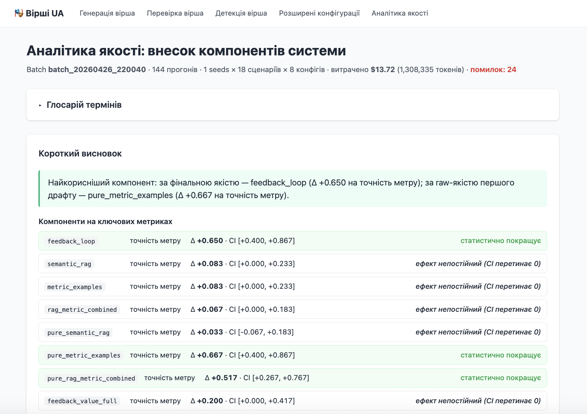
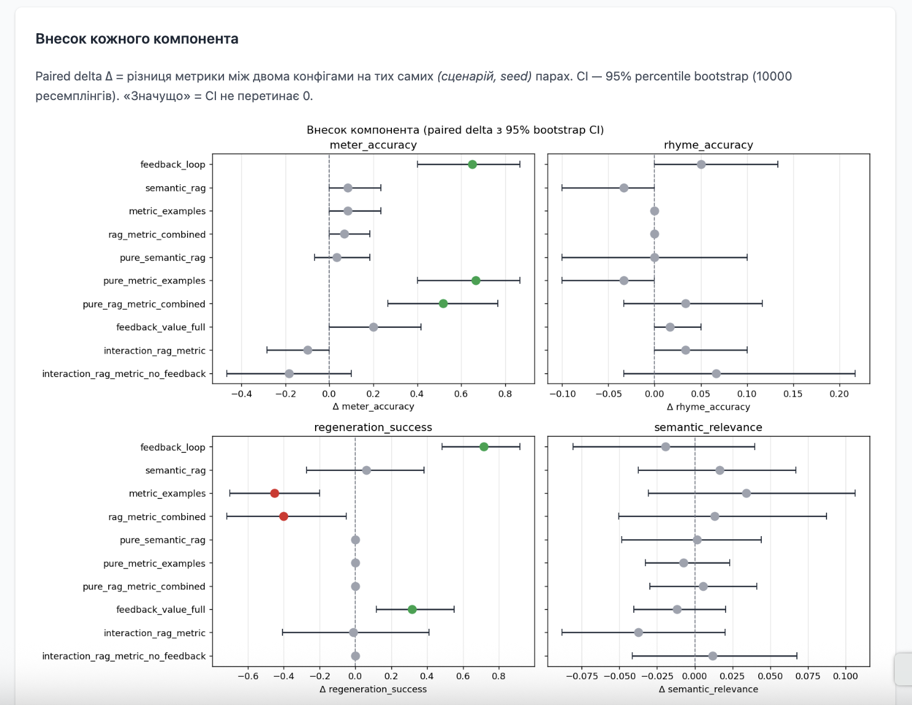
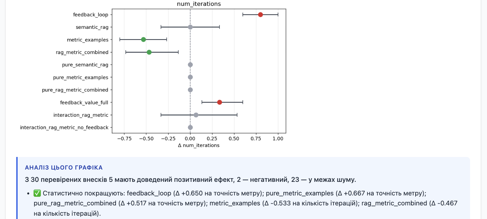
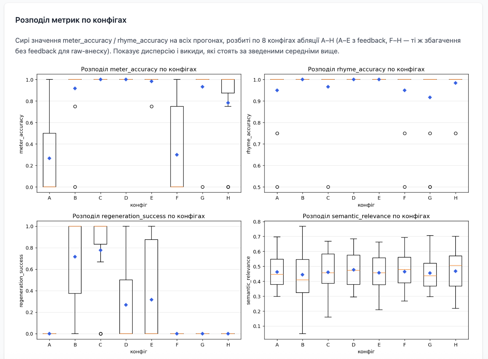
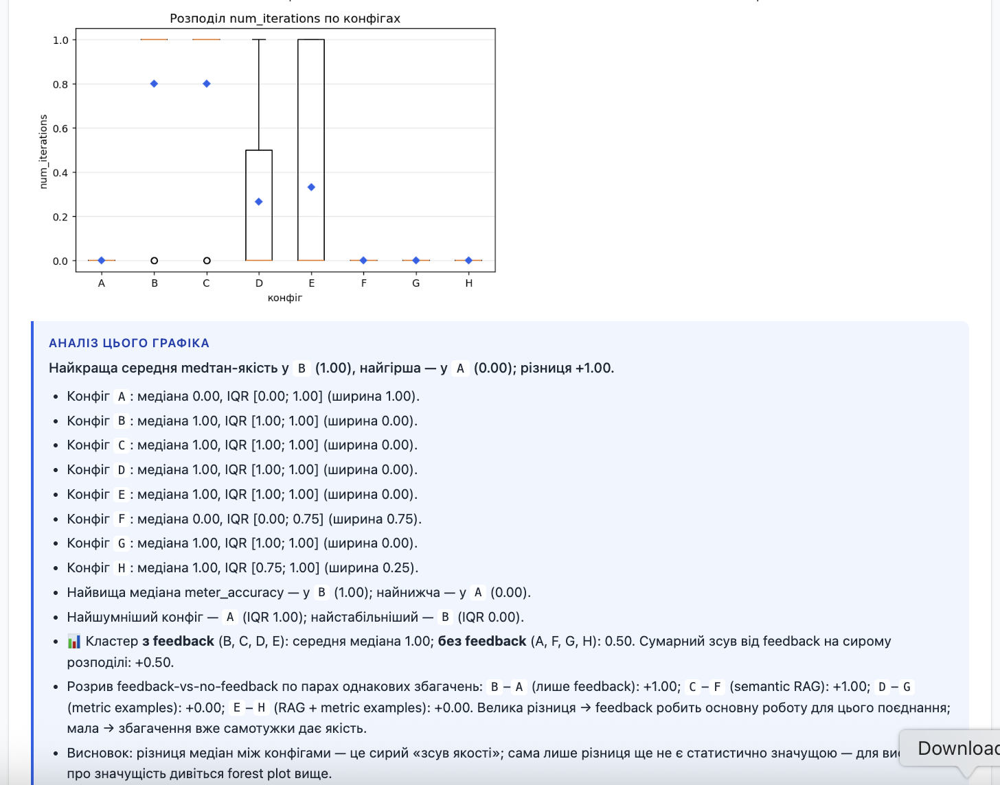

# Batch-evaluation і ablation-звіт (дослідницький рівень)

> Повний дослідницький конвеєр, що перетворює питання *«чи компонент X дійсно корисний?»* на **статистично обґрунтовану відповідь**. Три стадії: запустити матрицю → порахувати paired-Δ внески → відрендерити дашборд. Кожна стадія викликається окремо, тож збій квоти на стадії 1 не знищує роботу стадії 2.

Цей документ продовжує [evaluation_harness.md](./evaluation_harness.md). Harness — це *двигун абляції* (один прохід матриці = 18 сценаріїв × 8 конфігів = 144 запуски). **Batch-потік**, описаний тут, розширює цей двигун кількома seed-ами на клітинку, paired-Δ статистикою між конфігами та дашбордом, який перетворює сирі числа на висновок.

## Триетапний конвеєр у двох словах

```
┌──────────────────────────────────────────────────────────┐
│ Стадія 1:  make ablation        (scripts/run_batch_evaluation.py)
│            18 × 8 × seeds = N запусків через LLM
│            ───►  results/batch_<ts>/runs.csv
├──────────────────────────────────────────────────────────┤
│ Стадія 2:  make ablation-report RUNS=<runs.csv>
│            (scripts/analyze_contributions.py)
│            paired-Δ + bootstrap CI + Wilcoxon p
│            ───►  contributions.csv
│            ───►  contributions_by_cat.csv
│            ───►  report.json   (метадані + cost-агрегати)
│            ───►  plots/forest.png
│            ───►  plots/box_by_config.png
│            ───►  plots/heatmap.png
│            ───►  plots/contribution_by_cat.png
├──────────────────────────────────────────────────────────┤
│ Стадія 3:  /ablation-report     (HTML-дашборд)
│            GET /evaluation/ablation-report (JSON-двійник)
│            ───►  глосарій + графіки + авто-нарратив + insights
└──────────────────────────────────────────────────────────┘
```

Стадії обмінюються файлами через файлову систему (`results/batch_<ts>/`), а не in-memory pipeline. Це навмисно: стадія 1 — найдорожча (реальні LLM-виклики), і будь-який артефакт, який вона вже створила, переживає вичерпання квоти, мережевий збій або навіть рестарт процесу.

---

## Стадія 1 — `make ablation`

Визначено в [`Makefile:183-185`](../../Makefile#L183-L185) і [`scripts/run_batch_evaluation.py`](../../scripts/run_batch_evaluation.py); основна робота — у [`src/runners/batch_evaluation_runner.py`](../../src/runners/batch_evaluation_runner.py) і [`src/services/batch_evaluation_service.py`](../../src/services/batch_evaluation_service.py).

### Що робить

Для кожної трійки `(сценарій, ablation_config, seed)` викликає `EvaluationService.run_scenario(...)` і пише один рядок `BatchRunRow` (див. [`src/domain/evaluation.py:191`](../../src/domain/evaluation.py#L191)) у `runs.csv`. Рядки потрапляють на диск одразу після завершення — тож крах посеред батчу залишає частковий CSV з усіма завершеними рядками неушкодженими.

Вимір seed існує тому, що вихід LLM стохастичний. З одним seed на клітинку щаслива/нещаслива генерація може домінувати у вердикті. З кількома seed-ами paired-Δ статистика на стадії 2 кількісно оцінює, скільки з різниці — *реальний* внесок компонента, а скільки — *шум* стохастичності генерації.

### Змінні CLI / Make

| Змінна | За замовчуванням | Призначення |
|--------|------------------|-------------|
| `SEEDS` | `3` | Повторень на клітинку `(сценарій, конфіг)`. Загалом запусків = `seeds × n_сценаріїв × n_конфігів`. |
| `SCENARIO` | *(усі 18)* | Обмежити одним ID, наприклад `N01`. |
| `CONFIG` | *(усі A–H)* | Обмежити одним ablation-конфігом. **E** — рекомендований дефолт для повної системи; A–D — проміжні з feedback; F–H — research-only без feedback. |
| `CATEGORY` | *(усі)* | Фільтр за категорією: `normal`, `edge`, `corner`. |
| `DELAY` | `3` (с) | Скільки секунд runner спить між LLM-викликами — простір для rate-limit. Інжектується як `IDelayer.sleep`, тож тести пробігають за нуль реального часу. |
| `MAX_ITERATIONS` | `1` | Ліміт ітерацій feedback-регенерації на запуск. `0` = жодних feedback-ів навіть якщо конфіг B/C/D/E їх увімкнув. |
| `BATCH_DIR` | `results/batch_<ts>` | Папка для `runs.csv`. Використайте фіксовану назву для resume. |
| `RESUME` | *(off)* | При `1` читає існуючий `runs.csv` і пропускає клітинки, чий попередній запуск був успішним. |
| `SKIP_DEGENERATE` | *(off)* | Викидає сценарії з `expected_to_succeed=False` (C04 непідтримуваний метр, C08 нуль стоп) ще до матриці. Вони палять квоту даремно — стадія 2 все одно їх відфільтрує. |

### Семантика resume

Інцидент, який мотивував resume-флаг — щоденна квота Gemini у 250 RPD спрацювала на 156-му рядку з 270. Без resume увесь батч мусив починатись з 1-го рядка, оплачуючи вже-завершені рядки повторно. З `RESUME=1`:

1. Runner читає існуючий `runs.csv` через `read_existing_runs(...)`.
2. Рядки з непорожньою колонкою `error` відкидаються (їх потрібно перезапустити).
3. Успішні рядки потрапляють у `preserved_rows` (passed verbatim писачу першими), а їхні cell-ключі — у `skip_cells`.
4. Ітератор пропускає будь-яку трійку `(сценарій, конфіг, seed)` з `skip_cells` — жодного LLM-виклику, жодного спаленого токена.
5. Фінальний CSV — об'єднання: збережені рядки + новозапущені.

Контракт — відповідальність [`BatchEvaluationRunner._load_resume_state`](../../src/runners/batch_evaluation_runner.py#L122); перевіряється тестами в [`tests/unit/runners/test_batch_evaluation_runner.py`](../../tests/unit/runners/test_batch_evaluation_runner.py) у класі `TestResume`.

### Формат `runs.csv` — один рядок на запуск

Колонки відповідають полям `BatchRunRow`:

| Колонка | Тип | Примітки |
|---------|-----|----------|
| `scenario_id` | str | `N01`–`N05`, `E01`–`E05`, `C01`–`C08` |
| `scenario_name` | str | Зрозуміла назва |
| `category` | str | `normal` / `edge` / `corner` |
| `meter`, `foot_count`, `rhyme_scheme` | str/int/str | Дублюється зі сценарію для подальшої фільтрації |
| `config_label` | str | `A`–`H` |
| `config_description` | str | Дублюється з `AblationConfig.description` |
| `seed` | int | 0..seeds-1 |
| `meter_accuracy`, `rhyme_accuracy` | float | `[0, 1]` — заголовкові структурні метрики |
| `regeneration_success` | float | Δ покриття порушень (див. [feedback_loop.md](./feedback_loop.md)). Може бути **від'ємним**: feedback іноді шкодить. |
| `semantic_relevance` | float | Косинусна схожість теми та фінального вірша (LaBSE) |
| `num_iterations` | int | Скільки feedback-ітерацій реально пройшло |
| `num_lines` | int | Довжина згенерованого вірша |
| `duration_sec` | float | Wall-clock для всього запуску; з `IClock.now()` — тести можуть підкласти fake |
| `input_tokens`, `output_tokens`, `total_tokens` | int | Сумарне використання LLM-токенів |
| `estimated_cost_usd` | float | `input × $/M_in + output × $/M_out` (рахує `EstimatedCostCalculator`) |
| `iteration_tokens` | str | Поітераційне розбиття у форматі `it=<idx>:in=<n>:out=<n>,…` — щоб CSV лишався пласким |
| `error` | str/порожньо | Виставлене коли pipeline зкрашився; стадія 2 викидає такі рядки зі статистики |

### Абстракція часу

`BatchEvaluationService.__init__` приймає `IDelayer`; `EvaluationService.run_scenario` приймає `IClock` (див. [`src/domain/ports/clock.py`](../../src/domain/ports/clock.py)). Production wiring — `SystemDelayer` / `SystemClock`; тести інжектують `FakeDelayer` / `FakeClock`, тож unit-тести runner-а завершуються за мілісекунди, але все одно вправляють throttling- і timing-шляхи. Цим займається фікс №2 з аудиту.

---

## Стадія 2 — `make ablation-report`

Реалізовано в [`scripts/analyze_contributions.py`](../../scripts/analyze_contributions.py); викликається з [`Makefile:198-204`](../../Makefile#L198).

### Що робить

Читає `runs.csv`, рахує **paired-Δ статистику** для кожної пари (компонент, метрика), рендерить чотири matplotlib-PNG і пише агрегатний `report.json`. Вихідні файли лягають поряд із вхідним CSV — папка `batch_<ts>/` стає самодостатньою.

### Чому paired Δ

Кожен рядок у `runs.csv` — один запуск (сценарій, конфіг, seed). Щоб виміряти *ефект компонента*, не можна просто порівняти середні: різні сценарії мають кардинально різну базову складність, і шум від «цей сценарій легший за той» зашумлює реальний ефект компонента.

Трюк paired-Δ:
- Для кожної пари `(scenario_id, seed)` беремо значення метрики при конфігу X і при конфігу Y.
- Віднімаємо: `Δ = X − Y` — це **той самий сценарій з тим самим seed**, відрізняється лише вмикання компонента.
- Усереднюємо ці Δ по всіх парах `(scenario_id, seed)`, і отримуємо середній ефект компонента, де складність сценарію *спарена геть*.

Саме це і робить `ContributionAnalyzer._compute`: pivot на `(scenario_id, seed)` × `config_label`, потім різниці колонок.

### Визначення компонентів (п'ять порівнянь)

```
feedback_loop          = B − A         (на додачу до baseline)
semantic_rag           = C − B         (на додачу до feedback)
metric_examples        = D − B         (на додачу до feedback)
rag_metric_combined    = E − B         (обидва RAG-варіанти разом)
interaction_rag_metric = E − C − D + B (2-way interaction)
```

Двофакторний interaction говорить, чи два RAG-варіанти **синергічні, адитивні чи конкурують**:

- `Δ_interaction > 0` → синергія (сума більша за частини)
- `Δ_interaction ≈ 0` → ефекти просто складаються
- `Δ_interaction < 0` → конкуренція (один варіант пригнічує інший — наприклад, борються за бюджет промпта)

### Метрики, що аналізуються

`METRICS = ("meter_accuracy", "rhyme_accuracy", "regeneration_success", "semantic_relevance")`. Перші дві — заголовкові структурні; інші дві видобувають ефект цикла регенерації та тематичну узгодженість.

### Статистична значущість

Для кожної пари (компонент, метрика) аналізатор повертає:

- **`mean_delta`** — середнє paired-Δ-вектора.
- **`ci_low`, `ci_high`** — 95 % перцентильний **bootstrap-довірчий інтервал** на цьому середньому. 10 000 ресемплінгів; seeded RNG (`RNG_SEED = 42`), тож звіт відтворюваний.
- **`p_value`** — двосторонній **Wilcoxon signed-rank** p-value. Непараметричний, стійкий до ненормальних розподілів Δ (LLM-вихід має тяжкі хвости). Повертає 1.0, коли тест невизначений (усі Δ нульові).
- **`significant`** — похідний прапорець: **CI не перетинає нуль**. Використовуємо саме його (а не p-value), бо при малих *n* bootstrap-CI — чесніший сигнал; p-value доданий для повноти, але не керує вердиктами дашборду.

### Як ці статистики рахуються — приклад на пальцях

> Ці кроки відповідають коду в [`scripts/analyze_contributions.py`](../../scripts/analyze_contributions.py). Розгортайте секції за потреби.

Реалії типового батчу: **`SEEDS = 1`** (один запуск на клітинку `(сценарій, конфіг)`). Тоді pivot-індекс `(scenario_id, seed)` фактично зводиться до `scenario_id`, і кожна пара paired-Δ — це один сценарій під двома конфігами. Якщо у матриці 18 сценаріїв і всі пройшли без помилок, **`n = 18`**. Якщо `SEEDS = 3` — формула не змінюється, лише в Δ-вектор потрапляє по 3 рядки на сценарій, тож `n = 54`. Усе подальше залежить лише від Δ-вектора, не від того, як він склався.

<details>
<summary><b>Крок 0 · дані для прикладу (seeds = 1, 6 сценаріїв)</b></summary>

Зріз із `runs.csv` для метрики `meter_accuracy`, конфіги `A` (baseline) і `B` (baseline + feedback):

| `scenario_id` | `seed` | `config_label` | `meter_accuracy` |
|---|---|---|---|
| N01 | 1 | A | 0.72 |
| N01 | 1 | B | 0.80 |
| N02 | 1 | A | 0.68 |
| N02 | 1 | B | 0.80 |
| E02 | 1 | A | 0.40 |
| E02 | 1 | B | 0.50 |
| E03 | 1 | A | 0.49 |
| E03 | 1 | B | 0.55 |
| C04 | 1 | A | 0.60 |
| C04 | 1 | B | 0.56 |
| C06 | 1 | A | 0.60 |
| C06 | 1 | B | 0.65 |

Хочемо виміряти ефект компонента `feedback_loop` (порівняння `B − A`).

</details>

<details>
<summary><b>Крок 1 · pivot → paired-Δ-вектор</b></summary>

`df.pivot_table(index=["scenario_id","seed"], columns="config_label", values="meter_accuracy")`:

| (`scenario_id`, `seed`) | A | B | **Δ = B − A** |
|---|---|---|---|
| (N01, 1) | 0.72 | 0.80 | **+0.08** |
| (N02, 1) | 0.68 | 0.80 | **+0.12** |
| (E02, 1) | 0.40 | 0.50 | **+0.10** |
| (E03, 1) | 0.49 | 0.55 | **+0.06** |
| (C04, 1) | 0.60 | 0.56 | **−0.04** |
| (C06, 1) | 0.60 | 0.65 | **+0.05** |

**Δ-вектор:** `[+0.08, +0.12, +0.10, +0.06, −0.04, +0.05]`, `n = 6`.

```
mean_delta = (0.08 + 0.12 + 0.10 + 0.06 − 0.04 + 0.05) / 6 = 0.37 / 6 ≈ +0.0617
```

**Чому це чесніше за `mean(B) − mean(A)`?** У цьому прикладі обидва числа збігаються, бо вибірка збалансована. Але уявіть, що `A` був прогнаний лише на легких сценаріях (середнє ≈ 0.70), а `B` — лише на складних (середнє ≈ 0.55). Наївне `mean(B) − mean(A) = −0.15` сказало б «B погіршує», тоді як насправді ми порівнювали різні задачі. Pairing видаляє цей confound: кожна Δ міряна на **тому самому сценарії під тим самим seed-ом**, складність сценарію спарена геть.

</details>

<details>
<summary><b>Крок 2 · bootstrap CI (95 % перцентильний)</b></summary>

`n = 6` замало для нормального наближення t-CI, та й Δ-розподіли LLM-метрик зазвичай не нормальні (тяжкі хвости, інколи bimodal). Bootstrap не вимагає припущень про розподіл — він просто питає: *«якщо мій Δ-вектор репрезентативний для генеральної сукупності, як виглядав би mean при ще одному наборі з 6 спостережень?»*

Алгоритм:

1. Тягнемо `n = 6` Δ із наявного вектора **з поверненням** (якесь Δ беремо двічі, якесь пропускаємо). Перший ресемпл міг би бути `[+0.10, +0.08, +0.10, +0.05, +0.08, +0.12]` → mean = `+0.0883`.
2. Робимо це **10 000 разів** → отримуємо 10 000 «можливих mean-ів» (`boot_means`).
3. Сортуємо `boot_means` і беремо **2.5-й перцентиль** (`ci_low`) та **97.5-й перцентиль** (`ci_high`). Між ними лежать 95 % імовірних значень mean Δ.

Для нашого Δ-вектора bootstrap дає приблизно `CI ≈ [+0.02, +0.10]`. Точні числа варіюються між запусками; у прод-коді `RNG_SEED = 42` робить результат відтворюваним. CI **не перетинає нуль** → `significant = True`. Якби CI вийшов `[−0.02, +0.13]` — теж позитивне середнє, але перетинає нуль → `significant = False`, ефект може бути нульовим у межах варіації.

Векторизація через NumPy — тому 10 000 ітерацій для кожної з ~25 пар (компонент × метрика) виконуються за частки секунди:

```python
# bootstrap_ci у scripts/analyze_contributions.py
idx = rng.integers(0, n, size=(n_boot, n))     # 10000×6 матриця випадкових індексів
boot_means = samples[idx].mean(axis=1)         # 10000 mean-ів за один прохід
ci_low  = np.percentile(boot_means, 2.5)
ci_high = np.percentile(boot_means, 97.5)
```

</details>

<details>
<summary><b>Крок 3 · Wilcoxon signed-rank → p-value</b></summary>

Параметричний t-тест припускає нормальність Δ. Для LLM-метрик це часто не виконується, тому беремо непараметричний **Wilcoxon signed-rank** — він лише вимагає, щоб Δ були неперервними і симетричними навколо медіани.

Алгоритм:

1. Беремо **абсолютні значення** Δ і ранжуємо їх (найменше за модулем = ранг 1, наступне = 2 …).
2. Розкладаємо ранги на дві суми: `W+` — сума рангів додатних Δ, `W−` — сума рангів від'ємних.
3. Тест-статистика `W = min(W+, W−)`. Чим менше `W`, тим сильніше відхилення від H₀ (медіана Δ = 0).
4. P-value — імовірність побачити такий чи екстремальніший `W`, **якби справжня медіана Δ була нульовою**.

На нашому Δ-векторі `[+0.08, +0.12, +0.10, +0.06, −0.04, +0.05]`:

| `abs(Δ)` | rank | sign |
|---|---|---|
| 0.04 | 1 | − |
| 0.05 | 2 | + |
| 0.06 | 3 | + |
| 0.08 | 4 | + |
| 0.10 | 5 | + |
| 0.12 | 6 | + |

```
W+ = 2 + 3 + 4 + 5 + 6 = 20
W− = 1
W  = 1
```

5 із 6 Δ додатні, причому всі великі за модулем — інтуїтивно «компонент допомагає». Але при `n = 6` навіть такий розклад дає **двосторонній p ≈ 0.06–0.12** (точно — від `scipy.stats.wilcoxon`). На рівні `α = 0.05` він **не пройшов би**, попри те, що паттерн візуально однозначний — це і є проблема малих *n* для p-value.

> На реальному батчі (`n = 18` сценаріїв при `SEEDS = 1`) ситуація трохи краща, але p-value все одно нестабільний — він тримається біля 0.05 на ефектах, які CI вже впевнено визначає як стабільні. Тому **дашборд читає CI, не p-value**.

```python
# wilcoxon_p у scripts/analyze_contributions.py
nonzero = deltas[deltas != 0]                  # zero_method="wilcox" відкидає нульові Δ
return stats.wilcoxon(nonzero, zero_method="wilcox").pvalue
```

</details>

<details>
<summary><b>Крок 4 · інтеракція <code>E − C − D + B</code> — звідки формула</b></summary>

Чотири клітинки факторного 2×2 дизайну (усі поверх baseline-feedback `B`):

|  | semantic_rag OFF | semantic_rag ON |
|---|---|---|
| **metric_examples OFF** | B | C |
| **metric_examples ON**  | D | E |

«Прості» внески окремо: `C − B` (semantic RAG поверх feedback) і `D − B` (метричні приклади поверх feedback). Якщо ефекти **просто додаються**:

```
E (передбачене) = B + (C − B) + (D − B) = C + D − B
```

«Залишок» — те, що ми **зміряли в E**, мінус це передбачення:

```
Δ_interaction = E − (C + D − B) = E − C − D + B
```

| Знак | Інтерпретація |
|---|---|
| `> 0` | **Синергія** — два компоненти разом дають більше, ніж сума окремих внесків. Сигнал «вмикайте обидва». |
| `≈ 0` | Ефекти **просто складаються** — компоненти незалежні. |
| `< 0` | **Конкуренція** — один пригнічує інший (борються за бюджет промпта; один змішує сигнал іншого). |

Та сама формула застосована й до feedback-OFF половини матриці: `H − F − G + A` дає інтеракцію **без впливу feedback-loop-у** — можна побачити, чи синергія двох RAG-варіантів — їхня внутрішня властивість, чи її породжує feedback.

</details>

<details>
<summary><b>Чому саме цей набір методів</b></summary>

| Альтернатива | Чому ні |
|---|---|
| Незалежні вибірки замість pairing | Складність сценарію — найбільший confound; pairing її просто виключає одним відніманням |
| t-CI замість bootstrap CI | t-CI припускає нормальність Δ; LLM-метрики часто bimodal або з тяжкими хвостами |
| t-тест замість Wilcoxon | Те саме припущення про нормальність |
| P-value як головний вердикт | При `n = 18` (наш типовий розмір при `SEEDS = 1`) p-value нестабільний; CI водночас показує **і величину**, і **непевність** одним числом |
| Більший CI рівень (99 %) | 95 % — стандарт для звітів; 99 % зробив би всі CI ширшими, і майже ніщо не виглядало б «значущим» при наших розмірах вибірок |

> **Як підвищити статистичну потужність:** збільшити `SEEDS`. При `SEEDS = 3` (типовий research-режим) `n = 54`, CI стає ~1.7× вужчим (за √3), і слабкі компоненти, які при `SEEDS = 1` губляться у шумі, стають видимими. Платіть за це токенами і часом — батч стає у 3 рази довшим і дорожчим.

</details>

### Колонки `contributions.csv`

```
category, component, comparison, metric, n, mean_delta,
ci_low, ci_high, p_value, significant
```

`category` — `"overall"` для топ-таблиці; `contributions_by_cat.csv` має ту саму схему з `category ∈ {"normal", "edge", "corner"}` для розбиття по категоріях.

### `report.json`

Невеликий JSON-маніфест, який споживає дашборд:

```json
{
  "batch_id": "batch_20260425_204756",
  "runs_csv": "results/batch_20260425_204756/runs.csv",
  "total_runs": 270,
  "error_runs": 4,
  "seeds": 3,
  "n_scenarios": 18,
  "n_configs": 5,
  "configs": ["A", "B", "C", "D", "E"],
  "metrics": ["meter_accuracy", "rhyme_accuracy",
              "regeneration_success", "semantic_relevance"],
  "components": ["feedback_loop", "semantic_rag", "metric_examples",
                 "rag_metric_combined", "interaction_rag_metric"],
  "plots": { "forest": "plots/forest.png", "box": "plots/box_by_config.png",
             "heatmap": "plots/heatmap.png", "by_category": "plots/contribution_by_cat.png" },
  "bootstrap_iterations": 10000,
  "ci_level": 95.0,
  "cost": { /* …token & cost агрегати по конфігах… */ }
}
```

Cost-блок несе тоталі + поконфіговий розклад токенів/витрат (`_cost_summary` в аналізаторі). Саме його використовує рядок дашборду «Сумарно витрачено $X на N токенів».

### Чотири графіки

Усі рендеряться у безголовому режимі через `matplotlib.use("Agg")`, тож скрипт працює в контейнерах без дисплея.

| Файл | Що показує | Як читати |
|------|------------|-----------|
| `plots/forest.png` | Один рядок на компонент, error-bar `[ci_low, ci_high]` навколо `mean_delta`. Чотири підграфіки — по одному на метрику. | **Зелена** точка = значущий позитив. **Червона** = значущий негатив. **Сіра** = CI перетинає нуль (ефект непостійний). Вертикальна пунктирна лінія — `Δ = 0`. |
| `plots/box_by_config.png` | Boxplot кожної метрики по 8 конфігах A–H (без парування). Медіана, квартилі, викиди, середнє (синій ромб). | Висока «коробка» = шумний конфіг. Висока медіана E проти A = повна система реально рухає голку в середньому. Контраст E vs H показує внесок feedback-циклу окремо. |
| `plots/heatmap.png` | `(конфіг × сценарій)` середнього кожної метрики. | Зелене = високе, червоне = низьке. Для `regeneration_success` беремо диверсну палітру навколо нуля — метрика знакова. Червоні стовпці = сценарії, які жоден конфіг не вирішив; червоні рядки = погані конфіги. |
| `plots/contribution_by_cat.png` | Той самий paired-Δ + CI, що й forest plot, але розбитий за категоріями `normal` / `edge` / `corner`. | Типова картинка: компоненти майже нейтральні на `normal`, але помітно допомагають на `edge` / `corner` — baseline уже насичує легкі кейси, лишаючи «куди рости» лише на складніших. |

### Cost-summary (`_cost_summary`)

Агрегує використання токенів по всьому батчу і по конфігах:

- `total_input_tokens`, `total_output_tokens`, `total_tokens`
- `total_cost_usd` (сума `estimated_cost_usd` по успішних рядках)
- `avg_tokens_per_run`, `avg_cost_per_run_usd`
- `per_config[]` — ті самі поля у розрізі конкретного конфігу

Повертає нулі (а не `null`), коли token-колонок нема — щоб числові форматери в шаблоні не потребували спецкейсів.

---

## Стадія 3 — дашборд

Дві поверхні віддають **один і той самий payload**:

- **HTML**: `GET /ablation-report` (`src/handlers/web/routes/ablation_report.py`) рендерить [`ablation_report.html`](../../src/handlers/web/templates/ablation_report.html).
- **JSON**: `GET /evaluation/ablation-report` (`src/handlers/api/routers/evaluation.py`) повертає `AblationReportResponseSchema` для SPA.

Обидві викликають **один і той самий builder**: [`build_artifacts(results_dir, registry)`](../../src/handlers/shared/ablation_report.py) з `src/handlers/shared/ablation_report.py`. Web-рут рендерить результат через Jinja; API-рут переформовує в Pydantic. **Повертає `None` / 404, коли batch-артефактів нема.**

### Payload `BatchArtifacts`

`BatchArtifacts` (у `src/handlers/shared/ablation_report.py`) — канонічний value object:

```python
@dataclass
class BatchArtifacts:
    batch_id: str                      # напр. "batch_20260425_204756"
    metadata: dict                     # вміст report.json
    contributions: list[dict]          # рядки contributions.csv
    contributions_by_cat: list[dict]   # рядки contributions_by_cat.csv
    plot_urls: dict[str, str]          # назва → /results/<batch>/plots/*.png
    components: list[ComponentExplanation]   # статичний глосарій
    plot_explanations: dict[str, PlotExplanation]   # статичні методологічні підписи
    plot_analyses: dict[str, PlotAnalysis]   # авто-нарратив, обчислений з batch-чисел
    scenarios_by_category: list[dict]  # каталог сценаріїв по NORMAL/EDGE/CORNER
    configs: list[dict]                # каталог ablation-конфігів з довгими описами
    insights: dict                     # headline + (компонент, метрика) verdict-и + cost
```

Перші п'ять блоків — статика для конкретного batch (сирі числа + URL до PNG). Останні шість — **прошарок змісту**: читабельний нарратив, який перетворює числа на щось, що людина може процитувати у висновках.

### Статичний нарратив

Дві статичні таблиці їдуть із дашбордом:

- **`COMPONENT_GLOSSARY`** — для кожного компонента (feedback_loop, semantic_rag, metric_examples, rag_metric_combined, interaction_rag_metric): мітка, формула порівняння (`B − A` тощо), summary «що робить вмикання», і інтерпретаційний гайд щодо значення Δ.
- **`PLOT_GLOSSARY`** — для кожного графіка (forest, box, heatmap, by_category): заголовок, підпис «що відображено», гайд «як читати», підказка «на що звертати увагу». Методологія між батчами однакова, тож текст зашитий у код.

### Авто-нарратив по графіках (`PlotAnalysis`)

На відміну від статичного глосарію, ці виводи **обчислюються з реальних чисел поточного batch-у** і змінюються щоразу:

- **`_analyze_forest(contributions)`** — групує компоненти у ✅ покращують / ❌ шкодять / ⚪ непостійні (CI перетинає нуль), рахує лічильники, підбирає вердикт («X з Y компонентів довели позитив, …») і рекомендацію («вимкніть непостійні для економії токенів» проти «корпус потребує перегляду — поточний конфіг активно шкодить»).
- **`_analyze_box(runs)`** — поконфігова медіана + IQR; помічає шумні vs стабільні конфіги (IQR > 0.10 = «шумний»); вибирає найкращий/найгірший за медіаною.
- **`_analyze_heatmap(runs)`** — найкращий конфіг і найгірший (найскладніший) сценарій за середнім по seed-ах; список найгірших трьох клітинок `(конфіг, сценарій)`, якщо є нижче 0.5 точності метру.
- **`_analyze_by_category(by_cat)`** — для кожної категорії підбирає найкорисніший компонент на заголовкових метриках; зазначає, що «жоден компонент не значущий» — нормально на `normal` (baseline насичує) і ненормально на `edge` / `corner`.

Bullet-и, які повертають ці аналізатори, містять inline HTML-розмітку (`<code>`, `<b>`) для Jinja-шаблону. JSON API документує це в schema-docstring; SPA-клієнти або рендерять як HTML, або страйплять теги.

### Заголовкові `insights`

`_build_insights(contributions, metadata)` дає:

- **`headline`** — одне речення з найкориснішим компонентом (найбільший значущий позитивний Δ на заголовковій метриці), або fallback «жоден компонент не довів себе».
- **`component_lines`** — один bullet на пару (компонент, метрика) на `meter_accuracy` і `rhyme_accuracy`, із середнім, CI, вердиктом (`статистично покращує` / `статистично погіршує` / `ефект непостійний`) і CSS-tone-міткою (`positive` / `negative` / `neutral`) для стилів.
- **`cost_lines`** — короткі summary з `metadata["cost"]`: загальна сума, середня на клітинку, найдорожчий конфіг.

### Як виглядає дашборд

Скріншоти знято з реального прогону `make ablation-report` (`batch_20260426_220040`, 144 прогони, 1 seed, $13.72 загалом) і йдуть у тому ж порядку, що й сторінка згори донизу.












### Контракти URL дашборду

PNG-URL, що повертає `_plot_urls(batch_dir, metadata)`, обслуговуються FastAPI-mount-ом `/results` (налаштовано в [`src/handlers/api/app.py`](../../src/handlers/api/app.py)). І HTML-сторінка, і JSON-споживач можуть рендерити зображення напряму без перезаливу.

---

## Складаємо все докупи — типовий workflow

```bash
# 1. Запустити матрицю (реальний Gemini, ~270 викликів, 10–20 хв):
make ablation SEEDS=3

# Якщо зкрашився на квоту — resume у ту саму папку:
make ablation BATCH_DIR=results/batch_20260425_204756 RESUME=1

# 2. Побудувати contributions + графіки з CSV:
make ablation-report RUNS=results/batch_20260425_204756/runs.csv

# 3a. Відкрити HTML-дашборд:
make serve   # потім http://localhost:8000/ablation-report

# 3b. ...або зачитати JSON-двійник зі SPA:
curl http://localhost:8000/evaluation/ablation-report | jq .
```

Хочеш швидкий smoke-test? `make ablation SEEDS=1 SCENARIO=N01 CONFIG=E` запустить **одну** клітинку — зручно для перевірки wiring без спалення квоти.

---

## Ключові файли

- [`Makefile:139-204`](../../Makefile#L139) — цілі `make ablation`, `make ablation-report` і їхні змінні.
- [`scripts/run_batch_evaluation.py`](../../scripts/run_batch_evaluation.py) — argparse-обгортка для стадії 1.
- [`scripts/analyze_contributions.py`](../../scripts/analyze_contributions.py) — стадія 2: paired-Δ + графіки + report.json.
- [`src/runners/batch_evaluation_runner.py`](../../src/runners/batch_evaluation_runner.py) — `IRunner` для стадії 1 (резолюція сценаріїв/конфігів, resume-bookkeeping).
- [`src/services/batch_evaluation_service.py`](../../src/services/batch_evaluation_service.py) — цикл матриці з `IDelayer`-throttling-ом і потоковим записом.
- [`src/domain/evaluation.py`](../../src/domain/evaluation.py) — `AblationConfig`, `BatchRunRow`, `STAGE_*` константи.
- [`src/infrastructure/reporting/csv_batch_results_writer.py`](../../src/infrastructure/reporting/csv_batch_results_writer.py) — flat-row CSV-writer + `read_existing_runs` для resume.
- [`src/handlers/shared/ablation_report.py`](../../src/handlers/shared/ablation_report.py) — `build_artifacts()`, шарений web-ом і API; статичний глосарій + поплотові аналізатори + insights-builder.
- [`src/handlers/web/routes/ablation_report.py`](../../src/handlers/web/routes/ablation_report.py) — HTML-route (тонкий Jinja-обгорщик).
- [`src/handlers/api/routers/evaluation.py`](../../src/handlers/api/routers/evaluation.py) — `GET /evaluation/ablation-report` JSON-двійник.
- [`src/handlers/api/schemas.py`](../../src/handlers/api/schemas.py) — `AblationReportResponseSchema` + хелпери.
- [`tests/unit/runners/test_batch_evaluation_runner.py`](../../tests/unit/runners/test_batch_evaluation_runner.py) — тести оркестрації з fake-ами (`FakeBatchService`, `_StubRegistry`).
- [`tests/integration/handlers/api/test_routers.py`](../../tests/integration/handlers/api/test_routers.py) — `TestAblationReportEndpoint` (404-шлях) + scenarios-by-category + system/llm-info.

---

## Застереження

- **LLM-стохастичність — реальна.** Три seed-и — мінімум для змістовного bootstrap-CI; для слабкоефектних компонентів варто 5+ seed-ів, навіть якщо це додаткова квота.
- **`regeneration_success` може бути від'ємним.** Регенерація з feedback-ом може зламати раніше-OK-рядок. Диверсна палітра на heatmap робить це видимим, а не ховає в шкалі 0–1.
- **Сценарії з `expected_to_succeed=False`** фільтруються до contribution-аналізу (`_filter_successful` викидає рядки з непорожнім `error`), але вони все одно з'являються на heatmap, якщо не передати `SKIP_DEGENERATE=1` — корисно, коли хочете *побачити* паттерн збоїв; марнотратно, коли не хочете.
- **Bootstrap-CI seeded** (`RNG_SEED = 42`). Звіти відтворювані байт-у-байт із того самого `runs.csv`. Якщо хочете рандомізований CI, змініть seed у коді — флага немає (свідомо: відтворюваність переважує).
- **HTML-розмітка в bullet-нарраті­ві** — частина контракту. JSON-споживачі, яким треба чистий текст, мусять страйпати теги самостійно.
